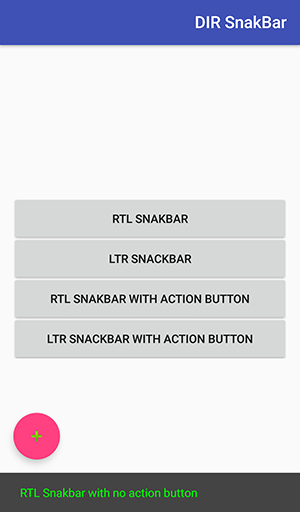
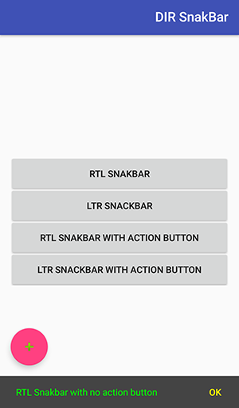
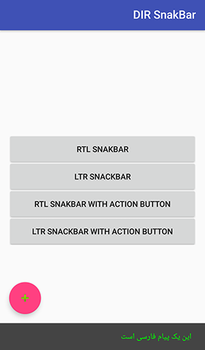
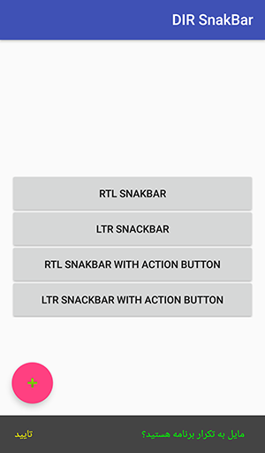

[](http://www.apache.org/licenses/LICENSE-2.0.html)
[](http://search.maven.org/#search%7Cga%7C1%7Ca%3A%22android-maven-gradle-plugin%22)

# RTL-Snackbar
***Right to left, Left to Right Snakbar base on android design library***
## Note:
* if you would like to use this library I'd rather you used Android library "26.0.1" or above.

Some languages such as Persian,Arabic has right to left context. In this case default Snackbar will put contexts in wrong position whether you didn't change your phone language. With this library you can easily set "Snackbar background color", "Title color", "Action color", "Title font", "Action font", "Title size", "Action size" and "Snakbar direction".







### How to use:
``` java
FloatingActionButton fab = (FloatingActionButton) findViewById(R.id.fab);
fab.setOnClickListener(new View.OnClickListener() {
			@Override
			public void onClick(View view) {
				SnackbarUtil.setSnackBarWithNoActionButton(fab, "RTL Snakbar with no action button",
						Color.GREEN, Color.DKGRAY, SnackbarUtil.LTR_DIRECTION);
			}
		});
```

### How to set direction:
By using "SnackbarUtil.LTR_DIRECTION" and "SnackbarUtil.RTL_DIRECTION" you can set Snakbar direction Ltr and RTL respectively.

### More commands in SnakbarUtil:
``` java
setSnackBarWithNoActionButton(View view, String title)

setSnackBarWithNoActionButton(View view, String title, int dir)

setSnackBarWithNoActionButton(View view, String title, Typeface tf,int dir)

setSnackBarWithNoActionButton(View view, String title, int textColor, int backGroundColor, int dir)

setSnackBarWithNoActionButton(View view, String title, int textColor, int backGroundColor, Typeface tf, int dir)

setSnackBarWithNoActionButton(View view, String title, int textColor, int backGroundColor, Typeface tf, float size, int dir)


showSnackBarWithActionButton(Context context, View view, String title, String actionTitle, View.OnClickListener listener)

showSnackBarWithActionButton(Context context, View view, String title, String actionTitle, int dir, View.OnClickListener listener)

showSnackBarWithActionButton(Context context, View view, String title, String actionTitle, Typeface tf, int dir,
	                                                View.OnClickListener listener)

showSnackBarWithActionButton(Context context, View view, String title, String actionTitle,
	                                                int titleColor, int actionColor,
	                                                int backGroundColor, Typeface tf, int dir,
	                                                View.OnClickListener listener)

showSnackBarWithActionButton(Context context, View view, String title, String actionTitle,
	                                                int titleColor, int actionColor,
	                                                int backGroundColor, int dir,
	                                                View.OnClickListener listener)

showSnackBarWithActionButton(Context context, View view, String title, String actionTitle,
	                                                int titleColor, int actionColor,
	                                                int backGroundColor, Typeface tf, float textSize, int dir,
	                                                View.OnClickListener listener)

showSnackBarWithActionButton(Context context, View view, String title, String actionTitle,
	                                                int titleColor, int actionColor,
	                                                int backGroundColor, Typeface tf0 , Typeface tf1, float titleSize, float actionSize,                                                     int dir, View.OnClickListener listener)
                                                  
```


## License

Copyright 2018 BrotherV

Licensed under the Apache License, Version 2.0 (the "License");
you may not use this file except in compliance with the License.
You may obtain a copy of the License at

   http://www.apache.org/licenses/LICENSE-2.0

Unless required by applicable law or agreed to in writing, software
distributed under the License is distributed on an "AS IS" BASIS,
WITHOUT WARRANTIES OR CONDITIONS OF ANY KIND, either express or implied.
See the License for the specific language governing permissions and
limitations under the License.
```

```
